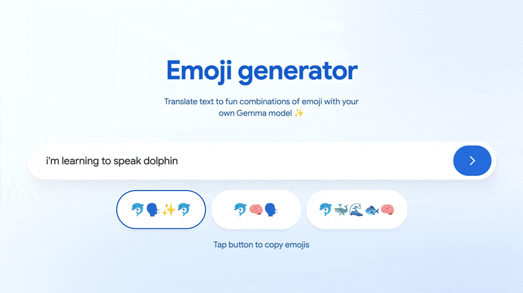

# Emoji Gemma web app
This demo runs a fine-tuned [Gemma 3 270M IT](https://huggingface.co/google/gemma-3-270m-it) model directly in the browser. Gemma 3 is supported by web AI frameworks that make deployment easy. You can run the app using either:

* **[MediaPipe LLM Inference API](./app-mediapipe)** - Requires a LiteRT model in a `.task` bundle
* **[Transformers.js](./app-transformersjs)** - Requires an `.onnx` model

If you don't have a model, view the resources below. 

Preview the app on [Hugging Face](https://huggingface.co/kr15t3n/gemmoji).

## Resources

### Notebooks
Notebooks to fine-tune and optimize Gemma 3 270M for web
| Notebook  | Description |
| ------------- |-------------|
| [Fine-tune Gemma 3 270M](./resources/Convert_Gemma_3_270M_to_ONNX.ipynb)   | Fine-tune the Transformers model using Quantized Low-Rank Adaptation (QLoRA) |
| [Convert to MediaPipe](./resources/Convert_Gemma_models_to_run_on_device_with_MediaPipe_LLM_Inference_API.ipynb) | Quantize and convert the model to `.litert`, then bundle into a `.task` file for use with the LLM Inference API |
| [Convert to ONNX](./resources/Convert_Gemma_3_270M_to_ONNX.ipynb) | Quantize and convert Gemma 3 to `.onnx` for use with Transformers.js via ONNX Runtime  |

### Datasets
Datasets provided in .csv format that you can use for fine-tuning. Community datasets coming soon!
* [Premade](./resources/Emoji%20Translation%20Dataset%20%20-%20Dataset.csv):  A dataset with 1000+ examples of text and corresponding emoji combinations
* [Blank](./resources/Emoji%20Translation%20Dataset%20Template%20-%20Dataset.csv): A dataset template to hold 'text' and 'emoji' pairs
